[](https://badge.fury.io/js/%40woven-planet%2Flakefront)

# lakefront
Lakefront is a simple React component library.

## Installation

Lakefront is available as an [npm package](https://www.npmjs.com/package/@woven-planet/lakefront).

```sh
// with npm
npm install @woven-planet/lakefront

// with yarn
yarn add @woven-planet/lakefront
```

Emotion's `ThemeProvider` must wrap your application for the components to style correctly.
```
import { ThemeProvider } from '@emotion/react';
import { theme } from '@woven-planet/lakefront';

<ThemeProvider theme={theme}>
    ...
</ThemeProvider>
```

## Usage
### ⚠️ <b>LakeFront requires the client application to use React 18 and the Node version in the [package.json](./package.json) ⚠️ </b>


Here is a quick example to get you started, **it's all you need**:

```jsx
import { createRoot } from 'react-dom/client';
import { Button } from '@woven-planet/lakefront';

function App() {
    return <Button>Hello World</Button>;
}

createRoot.render(<App />, document.querySelector('#app'));

```
## Contributing
If you want to contribute to the action, even by just raising a problem or proposing an idea, you can click [here](CONTRIBUTING.md) to find out how to do it.

---
## Storybook Components
We've added Storybook pages to show how each component can be used.

---
## How to add components to this table
Upon a new component being added to this table run 'npm run update-readme' for boilerplate code. Please replace the three variables with the corresponding information as needed. Also, store screenshots of components in the 'screenshots' folder.

Please do not add information below this table, the 'npm run update-readme' will not work properly if the table is not last.
---
| Component                                                                                                                                             | Picture  | Component                                                                                                                                                       | Picture  |
|:------------------------------------------------------------------------------------------------------------------------------------------------------| :------- |:----------------------------------------------------------------------------------------------------------------------------------------------------------------| :------- |
| [AnchorCopy](https://woven-planet.github.io/lakefront/?path=/docs/lakefront-anchorcopy--anchor-copy)                                       | <details><summary>Screenshot</summary></details> | [BoundingBoxes](https://woven-planet.github.io/lakefront/?path=/docs/lakefront-boundingboxes--bounding-boxes)                                        | <details><summary>Screenshot</summary>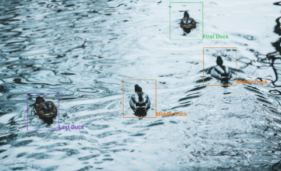</details> |
 | [Breadcrumb](https://woven-planet.github.io/lakefront/?path=/docs/lakefront-breadcrumb--breadcrumb)                                        | <details> <summary>Screenshot</summary></details> | [Button](https://woven-planet.github.io/lakefront/?path=/docs/lakefront-button--all-buttons)                                                         | <details><summary>Screenshot</summary>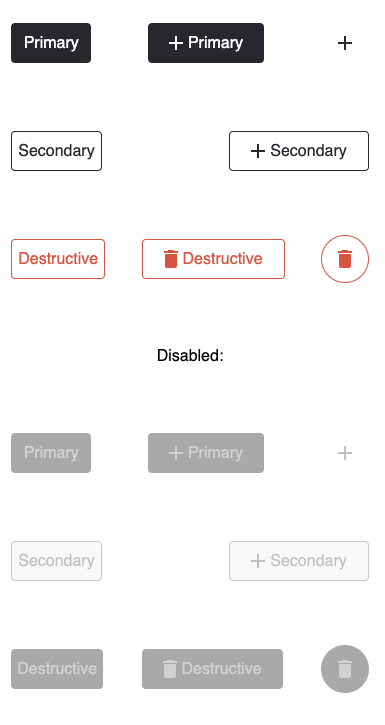</details> |
 | [Card](https://woven-planet.github.io/lakefront/?path=/docs/lakefront-card--card)                                                          | <details><summary>Screenshot</summary>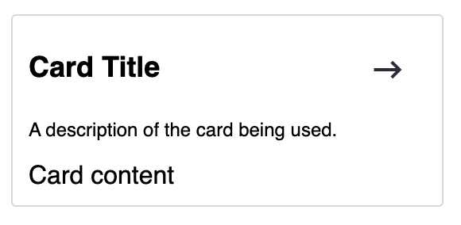</details> | [Checkbox](https://woven-planet.github.io/lakefront/?path=/docs/lakefront-checkbox--checkbox)                                                        | <details><summary>Screenshot</summary>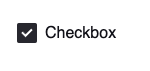</details> |
| [CheckboxGroup](https://woven-planet.github.io/lakefront/?path=/docs/lakefront-checkboxgroup--checkbox-group)                              | <details><summary>Screenshot</summary>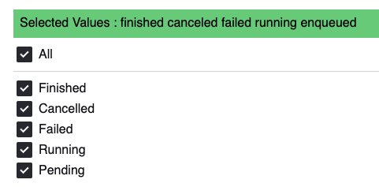</details> | [PopoverContent](https://woven-planet.github.io/lakefront/?path=/docs/lakefront-popovercontent--popover-content)                                     | <details><summary>Screenshot</summary>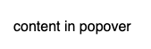</details> |
| [Collapsible](https://woven-planet.github.io/lakefront/?path=/docs/lakefront-collapsible--collapsible)                                     | <details><summary>Screenshot</summary></details> | [CopyButton](https://woven-planet.github.io/lakefront/?path=/docs/lakefront-copybutton--copy-button)                                                 | <details><summary>Screenshot</summary>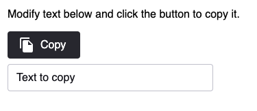</details> |
 | [Drawer](https://woven-planet.github.io/lakefront/?path=/docs/lakefront-drawer--drawer)                                                    | <details><summary>Screenshot</summary>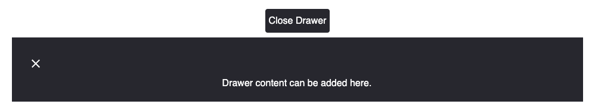</details> | [Filter](https://woven-planet.github.io/lakefront/?path=/docs/lakefront-filter-allfilters--no-filter-bar)                                            | <details><summary>Screenshot</summary></details> |
 | [AdditionalJSONFilter](https://woven-planet.github.io/lakefront/?path=/docs/lakefront-filter-additionaljsonfilter--additional-json-filter) | <details><summary>Screenshot</summary></details> | [DoubleMultiSelectFilter](https://woven-planet.github.io/lakefront/?path=/docs/lakefront-filter-doublemultiselectfilter--double-multi-select-filter) | <details><summary>Screenshot</summary></details> |
 | [DurationFilter](https://woven-planet.github.io/lakefront/?path=/docs/lakefront-filter-durationfilter--duration-filter)                    | <details><summary>Screenshot</summary>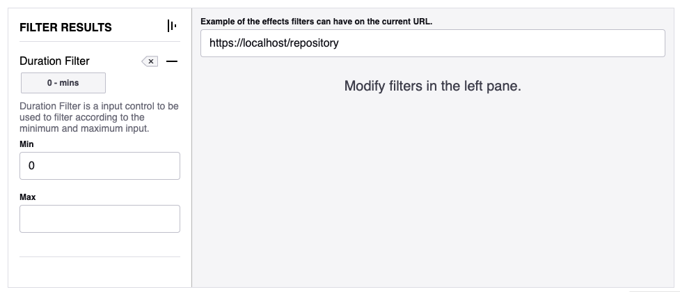</details>| [ListFilter](https://woven-planet.github.io/lakefront/?path=/docs/lakefront-filter-listfilter--list-filter)                                          | <details><summary>Screenshot</summary></details> |
 | [MultiSelectFilter](https://woven-planet.github.io/lakefront/?path=/docs/lakefront-filter-multiselectfilter--multi-select-filter)          | <details><summary>Screenshot</summary></details> | [RadioFilter](https://woven-planet.github.io/lakefront/?path=/docs/lakefront-filter-radiofilter--radio-filter)                                       | <details><summary>Screenshot</summary></details> |
 | [SingleSelectFilter](https://woven-planet.github.io/lakefront/?path=/docs/lakefront-filter-singleselectfilter--single-select-filter)       | <details><summary>Screenshot</summary></details> | [TextFilter](https://woven-planet.github.io/lakefront/?path=/docs/lakefront-filter-textfilter--text-filter)                                          | <details><summary>Screenshot</summary>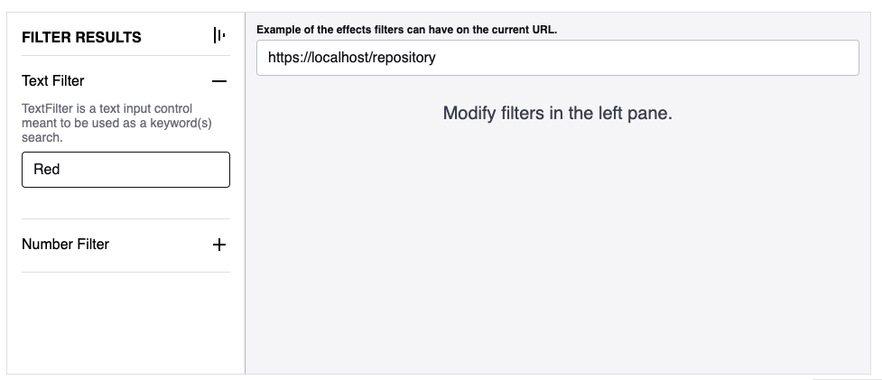</details> |
 | [Header](https://woven-planet.github.io/lakefront/?path=/docs/lakefront-header--header)                                                    | <details><summary>Screenshot</summary>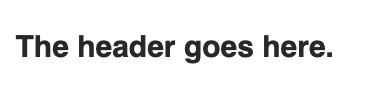</details> | [Input](https://woven-planet.github.io/lakefront/?path=/docs/lakefront-input--placeholder)                                                           | <details><summary>Screenshot</summary>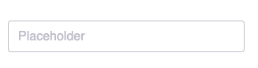</details> |
 | [ItemGrid](https://woven-planet.github.io/lakefront/?path=/docs/lakefront-itemgrid--item-grid)                                             | <details><summary>Screenshot</summary></details> | [ItemResults](https://woven-planet.github.io/lakefront/?path=/docs/lakefront-itemresults--item-results)                                              | <details><summary>Screenshot</summary>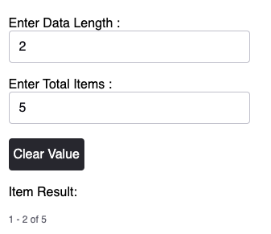</details> |
 | [Loading](https://woven-planet.github.io/lakefront/?path=/docs/lakefront-loading--loading)                                                 | <details><summary>Screenshot</summary></details> | [MaskableImage](https://woven-planet.github.io/lakefront/?path=/docs/lakefront-maskableimage--maskable-image)                                        | <details><summary>Screenshot</summary>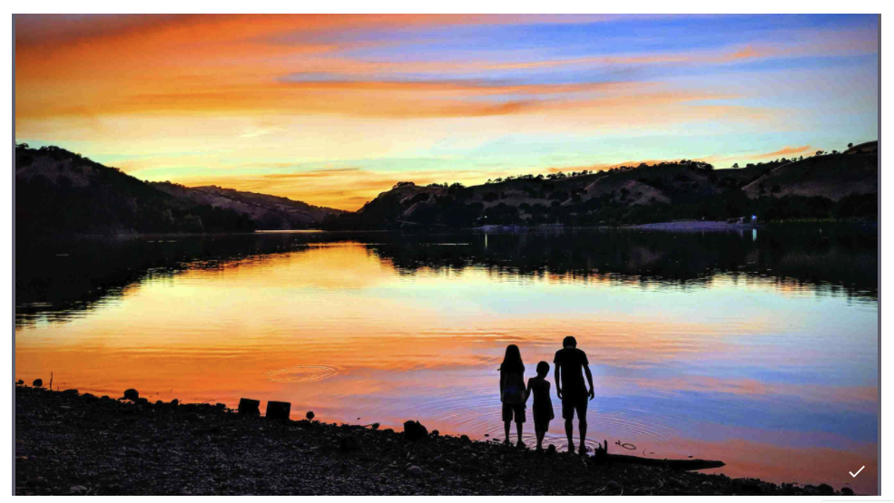</details>|
 | [Modal](https://woven-planet.github.io/lakefront/?path=/docs/lakefront-modal--simple-modal)                                                | <details><summary>Screenshot</summary>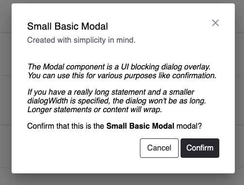</details> | [ConfirmationModal](https://woven-planet.github.io/lakefront/?path=/docs/lakefront-modal-confirmationmodal--basic-confirm)                           | <details><summary>Screenshot</summary>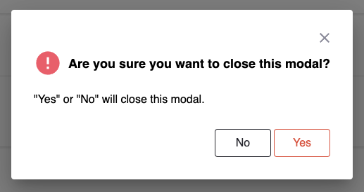</details> |
 | [Page](https://woven-planet.github.io/lakefront/?path=/docs/lakefront-page--page)                                                          | <details><summary>Screenshot</summary>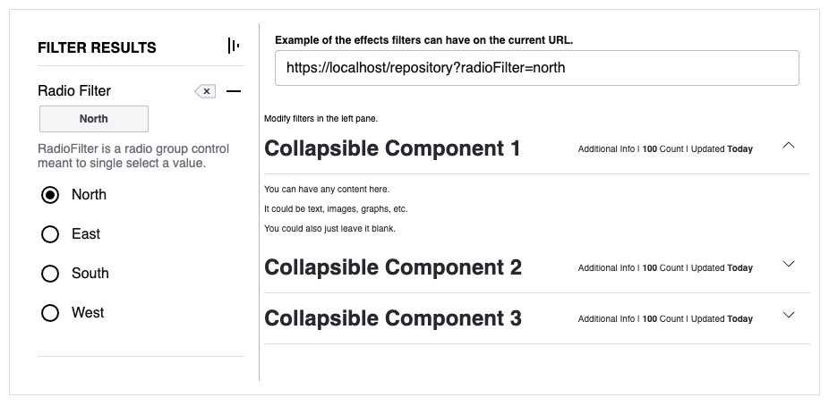</details> | [PlaybackBar](https://woven-planet.github.io/lakefront/?path=/docs/lakefront-playbackbar--playback-bar)                                              | <details><summary>Screenshot</summary>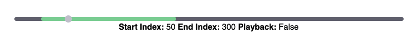</details> |
 | [Progress](https://woven-planet.github.io/lakefront/?path=/docs/lakefront-progress-progressbar--progress-bar)                              | <details><summary>Screenshot</summary>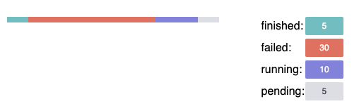</details> | [Circular Progress](https://woven-planet.github.io/lakefront/?path=/docs/lakefront-progress-circularprogress--circular-progress)                     | <details><summary>Screenshot</summary>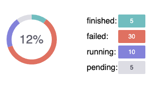</details> |
 | [Device Progress](https://woven-planet.github.io/lakefront/?path=/docs/lakefront-progress-deviceprogress--default-progress-bar)            | <details><summary>Screenshot</summary>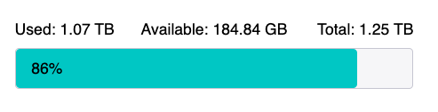</details> | [Progress Bar](https://woven-planet.github.io/lakefront/?path=/docs/lakefront-progress-progressbar--progress-bar)                                    | <details><summary>Screenshot</summary></details> |
 | [PropertyList](https://woven-planet.github.io/lakefront/?path=/docs/lakefront-propertylist--property-list)                                 | <details><summary>Screenshot</summary></details> | [RadioGroup](https://woven-planet.github.io/lakefront/?path=/docs/lakefront-radiogroup--standard-radio-group)                                        | <details><summary>Screenshot</summary></details>|
 | [RefreshToolBar](https://woven-planet.github.io/lakefront/?path=/docs/lakefront-refreshtoolbar--refresh-toolbar)                           | <details><summary>Screenshot</summary></details> | [Select](https://woven-planet.github.io/lakefront/?path=/docs/lakefront-select--select)                                                              | <details><summary>Screenshot</summary>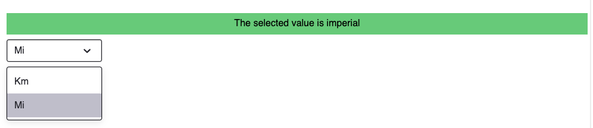</details> |
 | [SelectPopover](https://woven-planet.github.io/lakefront/?path=/docs/lakefront-selectpopover--popover)                                     | <details><summary>Screenshot</summary></details> | [Snackbar](https://woven-planet.github.io/lakefront/?path=/docs/lakefront-snackbar)                                                                  | <details><summary>Screenshot</summary>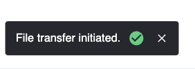</details> |
 | [SpeedInput](https://woven-planet.github.io/lakefront/?path=/docs/lakefront-speedinput--speed-input)                                       | <details><summary>Screenshot</summary>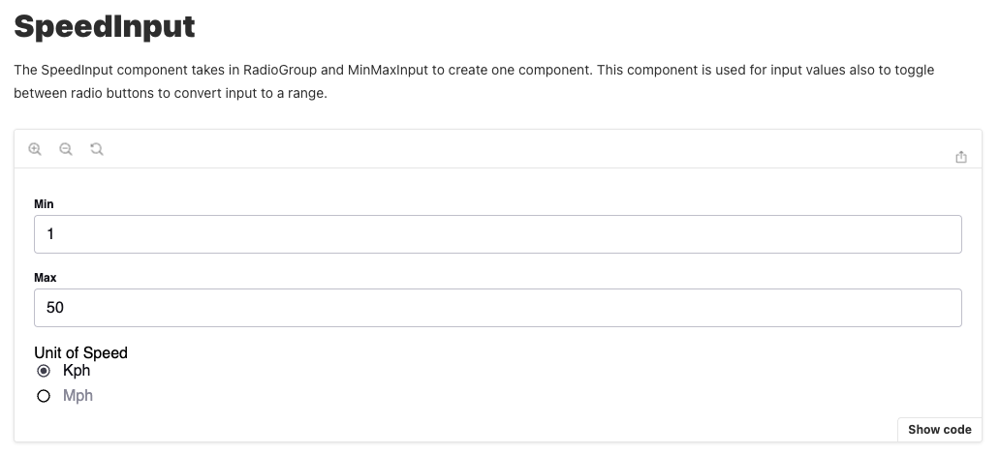</details> | [StackBanner](https://woven-planet.github.io/lakefront/?path=/docs/lakefront-stack-banner--stack-banner)                                             | <details><summary>Screenshot</summary></details> |
 | [StackBannerRow](https://woven-planet.github.io/lakefront/?path=/docs/lakefront-stack-banner-stack-banner-row--error)                      | <details><summary>Screenshot</summary>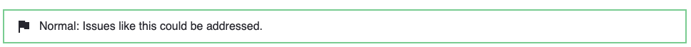</details> | [StepFunctionAuthoring](https://woven-planet.github.io/lakefront/?path=/docs/lakefront-stepfunctionauthoring--new-step-function)                     | <details><summary>Screenshot</summary></details> |
 | [StatusTable](https://woven-planet.github.io/lakefront/?path=/docs/lakefront-statustable--status-table-with-table-card)                    | <details><summary>Screenshot</summary>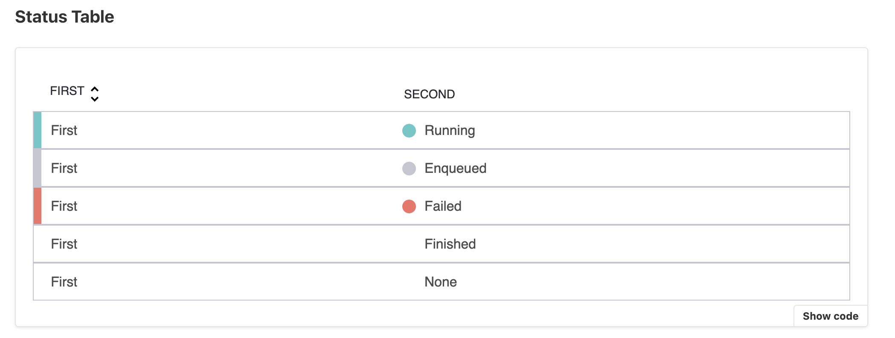</details> | [StepFunctionGraph](https://woven-planet.github.io/lakefront/?path=/docs/lakefront-stepfunctiongraph--simple-graph)                                  | <details><summary>Screenshot</summary></details> |
 | [StepFunctionRenderer](https://woven-planet.github.io/lakefront/?path=/docs/lakefront-stepfunctionrenderer--step-function-renderer)        |  <details><summary>Screenshot</summary>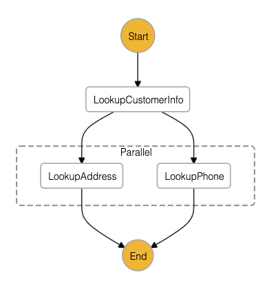</details> | [Table](https://woven-planet.github.io/lakefront?path=/docs/lakefront-table--table)                                                                  | <details><summary>Screenshot</summary></details> |
 | [Tabs](https://woven-planet.github.io/lakefront?path=/docs/lakefront-tabs--tabs)                                                           | <details><summary>Screenshot</summary></details> | [TextArea](https://woven-planet.github.io/lakefront/?path=/docs/lakefront-textarea--placeholder)                                                     | <details><summary>Screenshot</summary>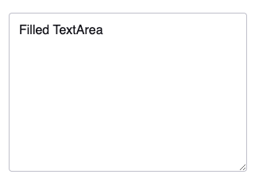</details> |
 | [Toggle](https://woven-planet.github.io/lakefront/?path=/docs/lakefront-toggle--toggle)                                                    | <details><summary>Screenshot</summary></details> | [TypeaheadSearch](https://woven-planet.github.io/lakefront/?path=/docs/lakefront-typeaheadsearch--search-bottom-start)                               |<details><summary>Screenshot</summary>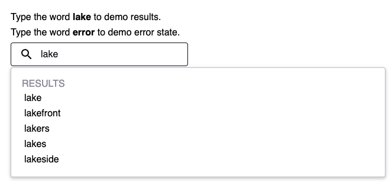</details> |
 | [ModeSelector](https://woven-planet.github.io/lakefront/?path=/docs/lakefront-modeselector--simple-mode-selector)                          | <details><summary>Screenshot</summary>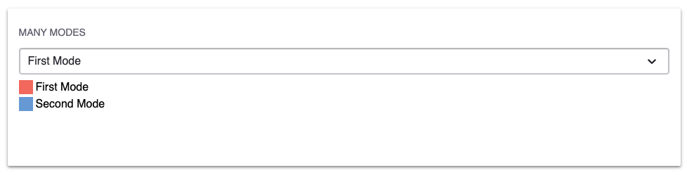</details> |
