[](https://badge.fury.io/js/%40toyota-research-institute%2Flakefront)

# lakefront
Lakefront is a simple React component library.

## Installation

Lakefront is available as an [npm package](https://www.npmjs.com/package/@toyota-research-institute/lakefront).

```sh
// with npm
npm install @toyota-research-institute/lakefront

// with yarn
yarn add @toyota-research-institute/lakefront
```

Emotion's `ThemeProvider` must wrap your application for the components to style correctly.
```
import { ThemeProvider } from '@emotion/react';
import { theme } from '@toyota-research-institute/lakefront';

<ThemeProvider theme={theme}>
    ...
</ThemeProvider>
```

## Usage

Here is a quick example to get you started, **it's all you need**:

```jsx
import ReactDOM from 'react-dom';
import { Button } from '@toyota-research-institute/lakefront';

function App() {
  return <Button>Hello World</Button>;
}

ReactDOM.render(<App />, document.querySelector('#app'));

```
---
## Storybook Components
We've added Storybook pages to show how each component can be used.

|  Component | Picture  | Component  | Picture  |
| :--------- | :------- | ---------: | -------: | 
[AnchorCopy](https://toyotaresearchinstitute.github.io/lakefront/?path=/docs/lakefront-anchorcopy--anchor-copy) | <details><summary>Screenshot</summary>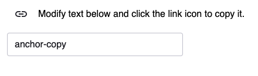</details> | [BoundingBoxes](https://toyotaresearchinstitute.github.io/lakefront/?path=/docs/lakefront-boundingboxes--bounding-boxes) | <details><summary>Screenshot</summary></details> |
[Breadcrumb](https://toyotaresearchinstitute.github.io/lakefront/?path=/docs/lakefront-breadcrumb--breadcrumb) | <details> <summary>Screenshot</summary></details> | [Button](https://toyotaresearchinstitute.github.io/lakefront/?path=/docs/lakefront-button--all-buttons) | <details><summary>Screenshot</summary></details> | 
[Checkbox](https://toyotaresearchinstitute.github.io/lakefront/?path=/docs/lakefront-checkbox--checkbox) | <details><summary>Screenshot</summary></details> | [CheckboxGroup](https://toyotaresearchinstitute.github.io/lakefront/?path=/docs/lakefront-checkboxgroup--checkbox-group) | <details><summary>Screenshot</summary></details>
|[Collapsible](https://toyotaresearchinstitute.github.io/lakefront/?path=/docs/lakefront-collapsible--collapsible) | <details><summary>Screenshot</summary>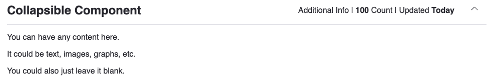</details> | [CopyButton](https://toyotaresearchinstitute.github.io/lakefront/?path=/docs/lakefront-copybutton--copy-button) | <details><summary>Screenshot</summary></details> |
[Drawer](https://toyotaresearchinstitute.github.io/lakefront/?path=/docs/lakefront-drawer--drawer) | <details><summary>Screenshot</summary></details> | [Filter](https://toyotaresearchinstitute.github.io/lakefront/?path=/docs/lakefront-filter-allfilters--no-filter-bar) | <details><summary>Screenshot</summary>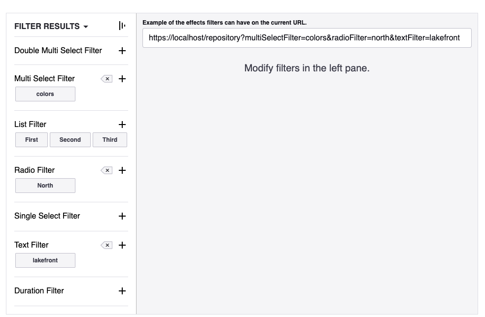</details> |
[AdditionalJSONFilter](https://toyotaresearchinstitute.github.io/lakefront/?path=/docs/lakefront-filter-additionaljsonfilter--additional-json-filter) | <details><summary>Screenshot</summary>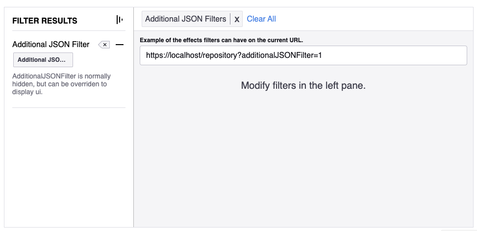</details> | [DoubleMultiSelectFilter](https://toyotaresearchinstitute.github.io/lakefront/?path=/docs/lakefront-filter-doublemultiselectfilter--double-multi-select-filter) | <details><summary>Screenshot</summary>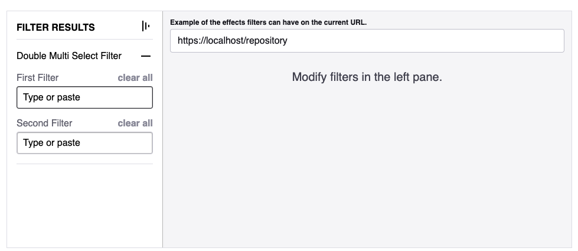</details> | 
[DurationFilter](https://toyotaresearchinstitute.github.io/lakefront/?path=/docs/lakefront-filter-durationfilter--duration-filter) | <details><summary>Screenshot</summary></details>| [ListFilter](https://toyotaresearchinstitute.github.io/lakefront/?path=/docs/lakefront-filter-listfilter--list-filter) | <details><summary>Screenshot</summary>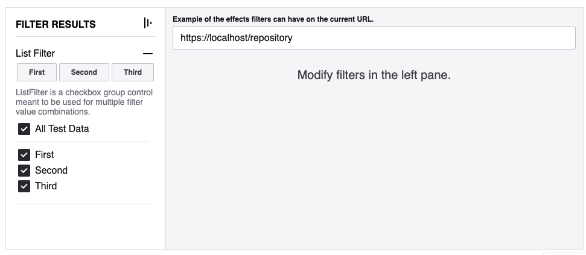</details> |
[MultiSelectFilter](https://toyotaresearchinstitute.github.io/lakefront/?path=/docs/lakefront-filter-multiselectfilter--multi-select-filter) | <details><summary>Screenshot</summary></details> | [RadioFilter](https://toyotaresearchinstitute.github.io/lakefront/?path=/docs/lakefront-filter-radiofilter--radio-filter) | <details><summary>Screenshot</summary>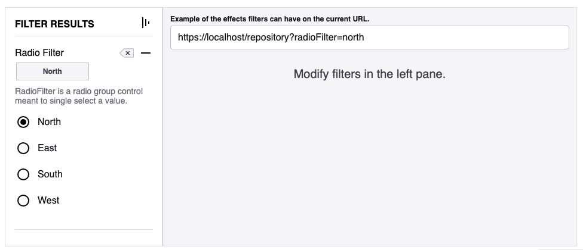</details> | 
[SingleSelectFilter](https://toyotaresearchinstitute.github.io/lakefront/?path=/docs/lakefront-filter-singleselectfilter--single-select-filter) | <details><summary>Screenshot</summary>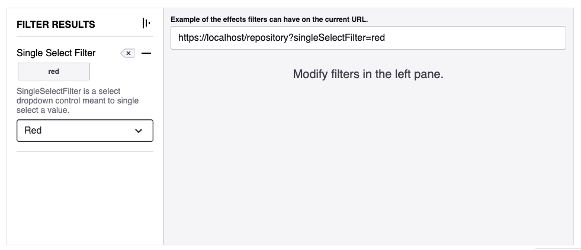</details> | [TextFilter](https://toyotaresearchinstitute.github.io/lakefront/?path=/docs/lakefront-filter-textfilter--text-filter) | <details><summary>Screenshot</summary></details> | 
[Header](https://toyotaresearchinstitute.github.io/lakefront/?path=/docs/lakefront-header--header) | <details><summary>Screenshot</summary></details> | [Input](https://toyotaresearchinstitute.github.io/lakefront/?path=/docs/lakefront-input--placeholder) | <details><summary>Screenshot</summary></details> | 
[ItemGrid](https://toyotaresearchinstitute.github.io/lakefront/?path=/docs/lakefront-itemgrid--item-grid) | <details><summary>Screenshot</summary></details> | [ItemResults](https://toyotaresearchinstitute.github.io/lakefront/?path=/docs/lakefront-itemresults--item-results) | <details><summary>Screenshot</summary></details> |
[Loading](https://toyotaresearchinstitute.github.io/lakefront/?path=/docs/lakefront-loading--loading) | <details><summary>Screenshot</summary></details> | [MaskableImage](https://toyotaresearchinstitute.github.io/lakefront/?path=/docs/lakefront-maskableimage--maskable-image) | <details><summary>Screenshot</summary></details>|
[Modal](https://toyotaresearchinstitute.github.io/lakefront/?path=/docs/lakefront-modal--simple-modal) | <details><summary>Screenshot</summary></details> | [ConfirmationModal](https://toyotaresearchinstitute.github.io/lakefront/?path=/docs/lakefront-modal-confirmationmodal--basic-confirm) | <details><summary>Screenshot</summary></details> | 
[Page](https://toyotaresearchinstitute.github.io/lakefront/?path=/docs/lakefront-page--page) | <details><summary>Screenshot</summary></details> | [PlaybackBar](https://toyotaresearchinstitute.github.io/lakefront/?path=/docs/lakefront-playbackbar--playback-bar) | <details><summary>Screenshot</summary></details> |
[Progress](https://toyotaresearchinstitute.github.io/lakefront/?path=/docs/lakefront-progress-progressbar--progress-bar) | <details><summary>Screenshot</summary></details> |  [Circular Progress](https://toyotaresearchinstitute.github.io/lakefront/?path=/docs/lakefront-progress-circularprogress--circular-progress) | <details><summary>Screenshot</summary></details> |
[Device Progress](https://toyotaresearchinstitute.github.io/lakefront/?path=/docs/lakefront-progress-deviceprogress--device-progress-bar) | <details><summary>Screenshot</summary>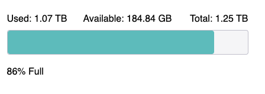</details> | [Progress Bar](https://toyotaresearchinstitute.github.io/lakefront/?path=/docs/lakefront-progress-progressbar--progress-bar) | <details><summary>Screenshot</summary>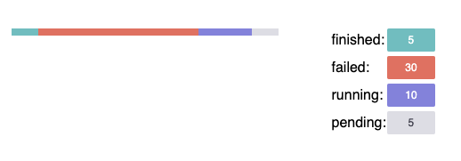</details> |
[PropertyList](https://toyotaresearchinstitute.github.io/lakefront/?path=/docs/lakefront-propertylist--property-list) | <details><summary>Screenshot</summary>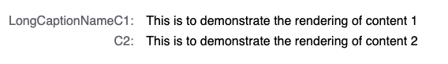</details> | [RadioGroup](https://toyotaresearchinstitute.github.io/lakefront/?path=/docs/lakefront-radiogroup--standard-radio-group) | <details><summary>Screenshot</summary>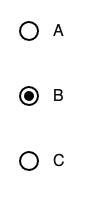</details>|
[RefreshToolBar](https://toyotaresearchinstitute.github.io/lakefront/?path=/docs/lakefront-refreshtoolbar--refresh-toolbar) | <details><summary>Screenshot</summary></details> | [Select](https://toyotaresearchinstitute.github.io/lakefront/?path=/docs/lakefront-select--select) | <details><summary>Screenshot</summary></details> |
[SelectPopover](https://toyotaresearchinstitute.github.io/lakefront/?path=/docs/lakefront-selectpopover--popover) | <details><summary>Screenshot</summary>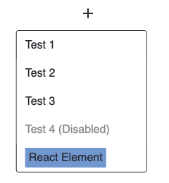</details> | [StackBanner](https://toyotaresearchinstitute.github.io/lakefront/?path=/docs/lakefront-stack-banner--stack-banner) | <details><summary>Screenshot</summary>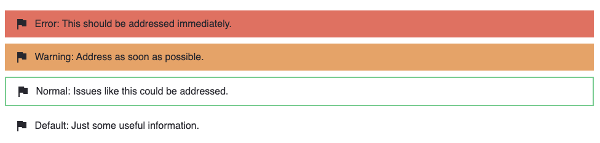</details> |
[StackBannerRow](https://toyotaresearchinstitute.github.io/lakefront/?path=/docs/lakefront-stack-banner-stack-banner-row--error) | <details><summary>Screenshot</summary></details> | [StepFunctionAuthoring](https://toyotaresearchinstitute.github.io/lakefront/?path=/docs/lakefront-stepfunctionauthoring--new-step-function) | <details><summary>Screenshot</summary>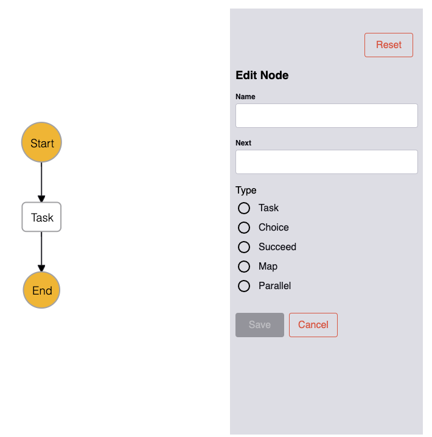</details> |
[StepFunctionGraph](https://toyotaresearchinstitute.github.io/lakefront/?path=/docs/lakefront-stepfunctiongraph--simple-graph) | <details><summary>Screenshot</summary></details> | [StepFunctionRenderer](https://toyotaresearchinstitute.github.io/lakefront/?path=/docs/lakefront-stepfunctionrenderer--step-function-renderer) |  <details><summary>Screenshot</summary></details> |
[Table](https://toyotaresearchinstitute.github.io/lakefront?path=/docs/lakefront-table--table) | <details><summary>Screenshot</summary>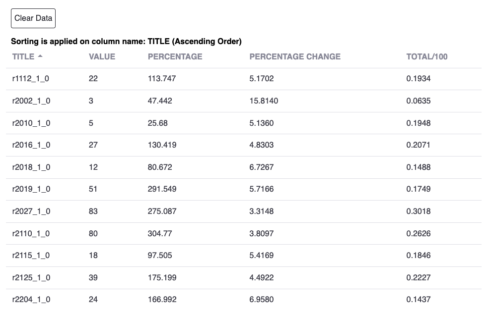</details> | [Tabs](https://toyotaresearchinstitute.github.io/lakefront?path=/docs/lakefront-tabs--tabs) | <details><summary>Screenshot</summary>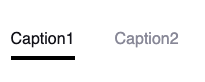</details> |
[TextArea](https://toyotaresearchinstitute.github.io/lakefront/?path=/docs/lakefront-textarea--placeholder) | <details><summary>Screenshot</summary></details> | [Toggle](https://toyotaresearchinstitute.github.io/lakefront/?path=/docs/lakefront-toggle--toggle) | <details><summary>Screenshot</summary>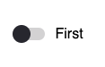</details> |
[TypeaheadSearch](https://toyotaresearchinstitute.github.io/lakefront/?path=/docs/lakefront-typeaheadsearch--search-bottom-start) | <details><summary>Screenshot</summary></details> 
---

## Contributing
If you want to contribute to the action, even by just raising a problem or proposing an idea, you can click [here](CONTRIBUTING.md) to find out how to do it.
